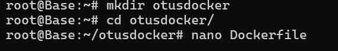
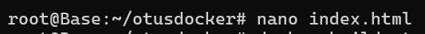
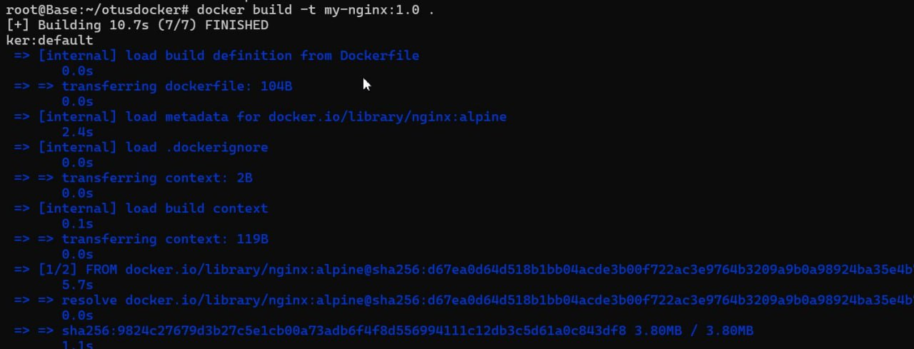
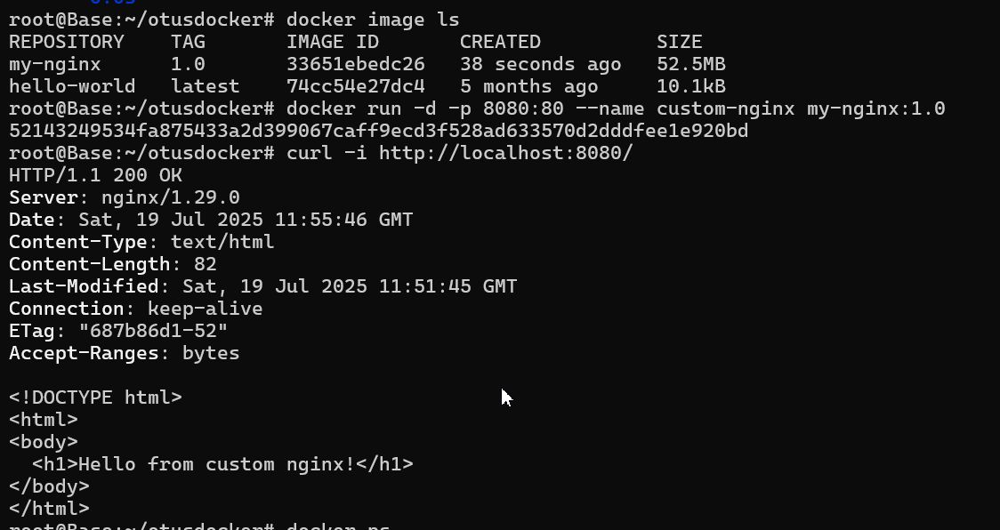
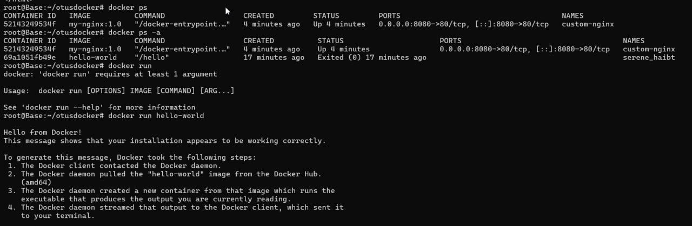
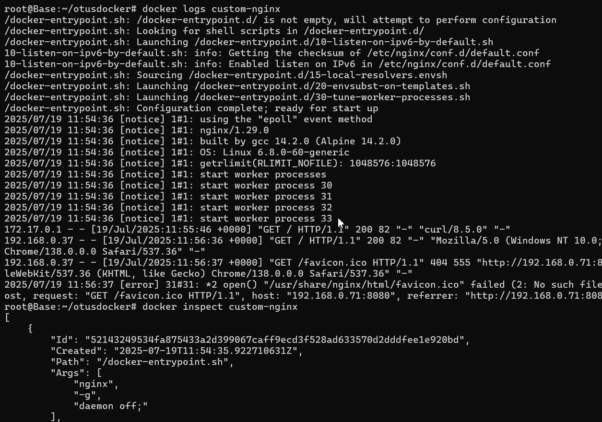
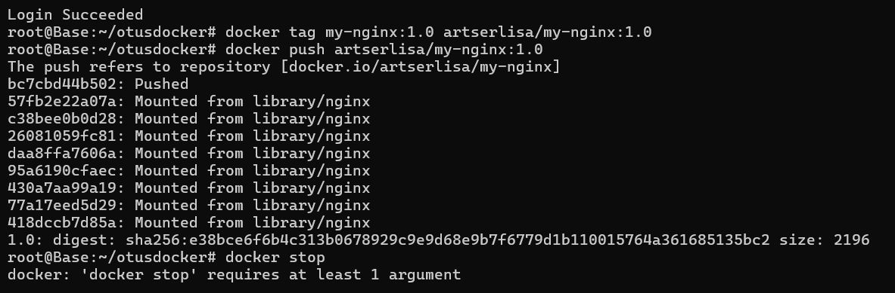
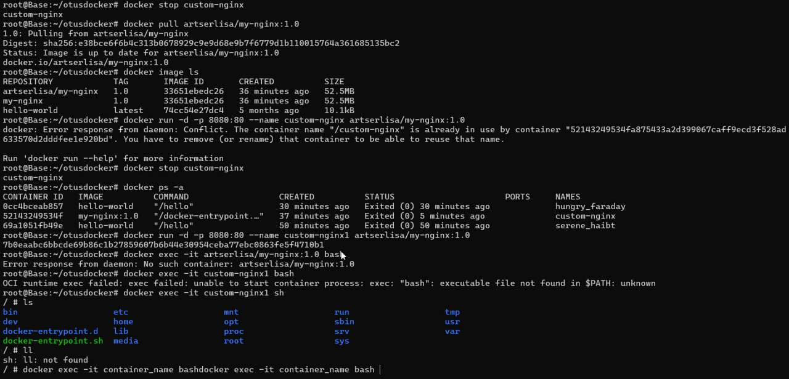

# Выполнение домашней работы по теме Docker: основы работы с контейнеризацией
### Цель домашнего задания.

#### Разобраться с основами docker, с образом, эко системой docker в целом;


1. Установим Docker на хост машину .
```
apt update
sudo apt-get install ca-certificates curl
install -m 0755 -d /etc/apt/keyrings

curl -fsSL https://download.docker.com/linux/ubuntu/gpg \
    -o /etc/apt/keyrings/docker.asc

echo \
  "deb [arch=$(dpkg --print-architecture) signed-by=/etc/apt/keyrings/docker.asc] \
  https://download.docker.com/linux/ubuntu \
  $(. /etc/os-release && echo "${UBUNTU_CODENAME:-$VERSION_CODENAME}") stable" | \
  sudo tee /etc/apt/sources.list.d/docker.list > /dev/null
  
  
 apt install docker-ce docker-ce-cli containerd.io docker-buildx-plugin docker-compose-plugin
 
 docker run hello-world
 
      
````
2 Установиv Docker Compose - как плагин
```
apt install docker-compose-plugin
```
3 Создадим свой кастомный образ nginx на базе alpine. После запуска nginx должен отдавать кастомную страницу \
(достаточно изменить дефолтную страницу nginx)



```
FROM nginx:alpine
COPY index.html /usr/share/nginx/html/index.html
```



```
<!DOCTYPE html>
<html>
<body>
  <h1>Hello from custom nginx!</h1>
</body>
</html>
```







4 Определите разницу между контейнером и образом
__Контейнер__  
При запуске контейнерной среды внутри контейнера создается копия файловой системы (docker образа) для чтения и записи.
Контейнер Docker (Docker Container) - это виртуализированная среда выполнения, в которой пользователи могут изолировать
приложения от хостовой системы. Эти контейнеры представляют собой компактные портативные хосты, в которых можно быстро
и легко запустить приложение.
Контейнеры работают автономно, изолированно от основной системы и других контейнеров, и потому ошибка в одном из них
не влияет на другие работающие контейнеры, а также поддерживающий их сервер.  
Один `Docker`-контейнер = 1 сервис, сами контейнеры создаются из образов `image`. Так же можно внести изменения в работающем контенере, потом закоммитить его и получить новый образ.
```php
docker commit 1e6229dd21rd nginxnew:v1.2
```


__Образ__     
Образ Docker (Docker Image) - это неизменяемый файл, содержащий исходный код, библиотеки, зависимости,
инструменты и другие файлы, необходимые для запуска приложения.
Образы предназначены только для чтения их иногда называют снимками (snapshot).
Они представляют приложение и его виртуальную среду в определенный момент времени.  
Так как образы являются просто шаблонами, их нельзя создавать или запускать.
Этот шаблон можно использовать в качестве основы для построения контейнера.
Образ - это шаблон, на основе которого создается контейнер, существует отдельно и не может быть изменен.  
Образ собирается из:
1) слоев, каждый слой собирается из своей директивы в Dockerfile'е, где директивы ENV и ARG не являются слоями и
2) начального образа, болванки, из директивы FROM в Dockerfile'е.

Таким образом, образы могут состоять из ряда слоев, каждый из которых отличается от предыдущего.
Слои образа представляют файлы, доступные только для чтения, поверх которых при создании контейнера добавляется новый слой.

Можно создать/запустить неограниченное количество контейнеров из одного образа.


Разница в том, что образ является основой для контейнера и не может быть изменен (read only), в отличие от контейнера который является экземпляром образа где производится запуск приложения, создавая при этом новый слой доступный для записи (copy-on-write).


__Отличие от виртуализации__  
В отличие от виртуальных машин, где виртуализация выполняется на аппаратном уровне,
контейнеры виртуализируются на уровне приложений. Они могут использовать одну машину,
совместно использовать ее ядро и виртуализировать операционную систему для выполнения
изолированных процессов. Это делает контейнеры чрезвычайно легкими, позволяя сохранять ценные ресурсы.


### 5. Можно ли в контейнере собрать ядро?
Да, в контейнере Docker можно собрать ядро Linux. Docker-контейнер предоставляет изолированную среду,  
в которой можно запускать любые процессы, включая сборку ядра. Однако есть несколько важных моментов,   
которые стоит учитывать:

**1. Ресурсы и права доступа:**  
   Для сборки ядра обычно требуется достаточно ресурсов (CPU, память) и доступ к исходным кодам и   
инструментам сборки. В контейнере нужно установить все необходимые зависимости (gcc, make, ncurses-devel и т.д.).

**2. Доступ к устройствам и модулям ядра:**  
   Сборка ядра — это процесс компиляции, который не требует прямого доступа к аппаратуре, но если вы хотите   
 тестировать или устанавливать собранное ядро, то это уже выходит за пределы контейнера.

**3. Размер образа:**
   Инструменты для сборки ядра и исходники могут занимать много места, поэтому образ будет достаточно большим.  

**4. Изоляция:**  
   Контейнер не предоставляет полноценной виртуализации, а использует ядро хоста. Поэтому   
вы не сможете запустить или загрузить новое ядро внутри контейнера — только собрать его.

Примерный подход:

• Создаёте Dockerfile на базе, например, Ubuntu или Debian.  
• Устанавливаете необходимые пакеты: build-essential, libncurses-dev, bison, flex и т.п.  
• Копируете исходники ядра в контейнер или скачиваете их внутри.  
• Запускаете команды сборки (make menuconfig, make, make modules_install и т.д.).  
