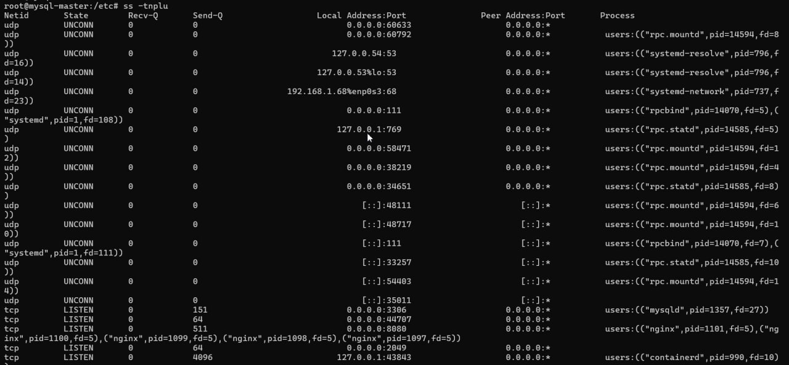

# Работа с NFS

Цель:
научиться самостоятельно разворачивать сервис NFS и подключать к нему клиентов;

Создаём тестовые виртуальные машины  
Создаём 2 виртуальные машины с сетевыми интерфейсами, которые позволяют связь между ними.  
Далее будем называть ВМ с NFS сервером mysql-master (IP 192.168.1.68), а ВМ с клиентом mysql-replica (IP 192.168.1.67). 
Настраиваем сервер NFS  
Заходим на сервер c NFS-сервером.  
Дальнейшие действия выполняются от имени пользователя имеющего повышенные привилегии, разрешающие описанные действия.  
Установим сервер NFS:  
root@mysql-master:/etc# apt install nfs-kernel-server    

Настройки сервера находятся в файле /etc/nfs.conf  
Проверяем наличие слушающих портов 2049/udp, 2049/tcp,111/udp, 111/tcp (не все они будут использоваться далее,  но их наличие сигнализирует о том, что необходимые сервисы готовы принимать внешние подключения):
root@mysql-master:/etc# ss -tnplu  

Создаём и настраиваем директорию, которая будет экспортирована в будущем  
root@mysql-master:/etc# mkdir -p /srv/share/upload  
root@mysql-master:/etc# chown -R nobody:nogroup /srv/share  
root@mysql-master:/etc# chmod 0777 /srv/share/upload   

Cоздаём в файле /etc/exports структуру, которая позволит экспортировать ранее созданную директорию:  
root@mysql-master:/etc# cat << EOF > /etc/exports  
/srv/share 192.168.1.67(rw,sync,root_squash)  
EOF  

Экспортируем ранее созданную директорию:  
root@mysql-master:/etc# exportfs -r  

Проверяем экспортированную директорию следующей командой  
root@mysql-master:/etc# exportfs -s  

Вывод должен быть аналогичен этому:  

root@mysql-master:/etc# exportfs -s  

Настраиваем клиент NFS  
Заходим на сервер с клиентом.  
Дальнейшие действия выполняются от имени пользователя имеющего повышенные привилегии, разрешающие описанные действия.  
Установим пакет с NFS-клиентом  
root@mysql-replica:~# sudo apt install nfs-common  

Добавляем в /etc/fstab строку  
root@mysql-replica:~# echo "192.168.1.68:/srv/share/ /mnt nfs vers=3,noauto,x-systemd.automount 0 0" >> /etc/fstab  

и выполняем команды:  
root@mysql-replica:~# systemctl daemon-reload  
root@mysql-replica:~# systemctl restart remote-fs.target  

Отметим, что в данном случае происходит автоматическая генерация systemd units в каталоге /run/systemd/generator/, которые производят монтирование при первом обращении к каталогу /mnt/.  
Заходим в директорию /mnt/ и проверяем успешность монтирования:  
root@mysql-replica:~# mount | grep mnt  

При успехе вывод должен примерно соответствовать этому:  
root@mysql-replica:# mount | grep mnt  
systemd-1 on /mnt type autofs (rw,relatime,fd=46,pgrp=1,timeout=0,minproto=5,maxproto=5,direct,pipe_ino=46033)
192.168.50.10:/srv/share/ on /mnt type nfs (rw,relatime,vers=3,rsize=131072,wsize=131072,namlen=255,hard,proto=tcp,timeo=600,retrans=2,sec=sys,mountaddr=192.168.50.10,mountvers=3,mountport=50749,mountproto=udp,local_lock=none,addr=192.168.50.10)

Обратите внимание на `vers=3`, что соответствует NFSv3, как того требует задание.  
Проверка работоспособности  
Заходим на сервер.  
Заходим в каталог /srv/share/upload.  
Создаём тестовый файл touch check_file.  
Заходим на клиент.  
Заходим в каталог /mnt/upload.  
Проверяем наличие ранее созданного файла.  
Создаём тестовый файл touch client_file.  
Проверяем, что файл успешно создан.  

Если вышеуказанные проверки прошли успешно, это значит, что проблем с правами нет.  

Предварительно проверяем клиент:  
перезагружаем клиент;  
заходим на клиент;  
заходим в каталог /mnt/upload;  
проверяем наличие ранее созданных файлов.  

