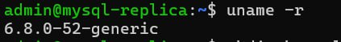
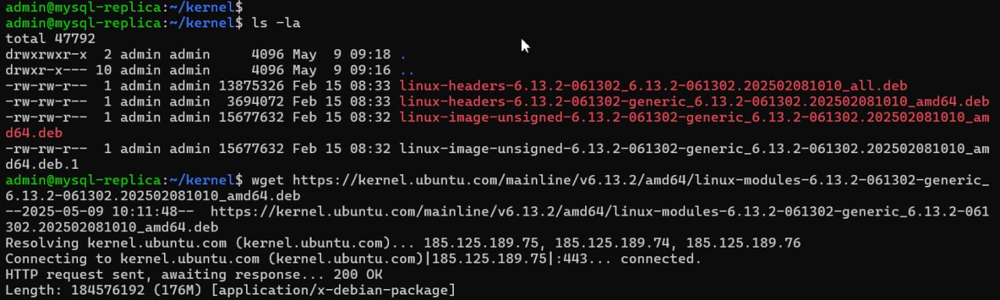
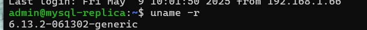

# LinuxPartII
Что потребуется сделать?

Запустить ВМ c Ubuntu.
Обновить ядро ОС на новейшую стабильную версию из mainline-репозитория.
Оформить отчет в README-файле в GitHub-репозитории.

1 Перед работами проверим текущую версию ядра:

  
Далее зайдём браузеров в репозиторий, где найдём свежую версию ядра для нашей архитектуры https://kernel.ubuntu.com/mainline .
На момент составления документа нам подходит версия 6.13.2: https://kernel.ubuntu.com/mainline/v6.13.2/
Архитектура системы для процессоров типа x86_64 (uname -p) требуется amd64.
Находим актуальную ссылку и качаем пакеты на виртуальную машину:  
[admin@mysql-replica ~]$ mkdir kernel && cd kernel  
[admin@mysql-replica ~]$ wget https://kernel.ubuntu.com/mainline/v6.13.2/amd64/linux-headers-6.13.2-061302-generic_6.13.2-061302.202502081010_amd64.deb  
[admin@mysql-replica ~]$ wget https://kernel.ubuntu.com/mainline/v6.13.2/amd64/linux-headers-6.13.2-061302_6.13.2-061302.202502081010_all.deb  
[admin@mysql-replica ~]$ wget https://kernel.ubuntu.com/mainline/v6.13.2/amd64/linux-image-unsigned-6.13.2-061302-generic_6.13.2-061302.202502081010_amd64.deb  
[admin@mysql-replica ~]$ wget https://kernel.ubuntu.com/mainline/v6.13.2/amd64/linux-modules-6.13.2-061302-generic_6.13.2-061302.202502081010_amd64.deb  

Устанавливаем все пакеты сразу:  
[admin@mysql-replica ~]$ sudo dpkg -i *.deb  

Проверяем, что ядро появилось в /boot.  
[admin@mysql-replica ~]$ ls -al /boot  

Далее перезагружаем нашу виртуальную машину с помощью команды sudo reboot   

