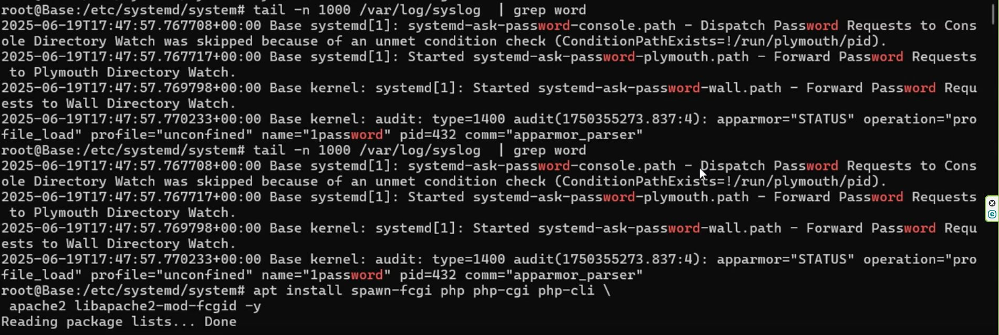
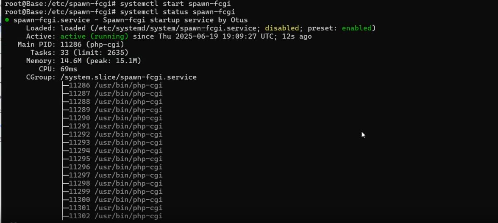
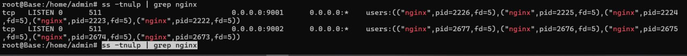

# Выполнение домашней работы по теме SystemD
### Задание №1 Написать service, который будет раз в 30 секунд мониторить лог на предмет наличия ключевого слова (файл лога и ключевое слово должны задаваться в /etc/default).
1. Создаём файл с конфигурацией для сервиса в директории /etc/default - из неё сервис будет брать необходимые переменные.
```
touch /etc/default/watchlog
````
Вносим конфигурацию
```
# Configuration file for my watchlog service
# Place it to /etc/default

# File and word in that file that we will be monit
WORD="ALERT"
LOG=/var/log/watchlog.log
```
2. Затем создаем /var/log/watchlog.log и пишем туда строки, в которых будет  ключевое слово "ALERT"
```
touch /var/log/watchlog.log
```
Закинем несколько строк и добавим ключевое слово
```
Jun 13 08:12:29 lvm systemd[1]: Finished systemd-sysctl.service - Apply Kernel Variables.
Jun 13 08:12:29 lvm systemd[1]: Finished systemd-journal-flush.service - Flush Journal to Persistent Storage.
Jun 13 08:12:29 lvm multipathd[387]: multipathd v0.9.4: start up ALERT #Ключевое слово
Jun 13 08:12:29 lvm multipathd[387]: reconfigure: setting up paths and maps
Jun 13 08:12:29 lvm systemd[1]: Finished systemd-sysusers.service - Create System Users.
```
3. Создаём скрипт, который будет искать ключевое слово в нашем log файле
```
touch /opt/watchlog.sh
```
```
#!/bin/bash

WORD="$1"
LOG="$2"
DATE=$(date)

# Проверка, переданы ли оба аргумента
if [[ -z "$WORD" || -z "$LOG" ]]; then
    echo "Usage: $0 <word> <logfile>"
    exit 1
fi

# Проверка существования файла
if [[ ! -f "$LOG" ]]; then
    echo "Error: File $LOG does not exist!"
    exit 2
fi

if grep -q "$WORD" "$LOG"; then
    logger "$DATE: I found the word '$WORD' in $LOG!"
fi
```
Добавим права на запуск скрипту
```
chmod +x /opt/watchlog.sh
```
4. Создаём юнит для сервиса
```
touch /etc/systemd/system/watchlog.service
```
```                    
[Unit]
Description=My watchlog service

[Service]
Type=oneshot
EnvironmentFile=/etc/default/watchlog
ExecStart=/opt/watchlog.sh $WORD $LOG
````
5. Создаем юнит для таймера
```
touch /etc/systemd/system/watchlog.timer
```
```
[Unit]
Description=Run watchlog script every 30 second

[Timer]
# Run every 30 second
OnUnitActiveSec=30
Unit=watchlog.service

[Install]
WantedBy=timers.target
```
6. Проверяем
```
systemctl daemon reload
systemctl start watchlog.timer
```


```
root@my:~# tail -n 1000 /var/log/syslog  | grep word

```


## Задание №2 Установить spawn-fcgi и создать unit-файл (spawn-fcgi.sevice) с помощью переделки init-скрипта
1. Устанавливаем spawn-fcgi и необходимые для него пакеты:


```
apt install spawn-fcgi php php-cgi php-cli  apache2 libapache2-mod-fcgid -y
```
2. Создаем файл с настройками для будущего сервиса
```
touch /etc/spawn-fcgi/fcgi.conf
```
```
# You must set some working options before the "spawn-fcgi" service will work.
# If SOCKET points to a file, then this file is cleaned up by the init script.
#
# See spawn-fcgi(1) for all possible options.
#
# Example :
SOCKET=/var/run/php-fcgi.sock
OPTIONS="-u www-data -g www-data -s $SOCKET -S -M 0600 -C 32 -F 1 -- /usr/bin/php-cgi"
```
3. Создаём юнит файл для для spawn-fcgi
```
touch /etc/systemd/system/spawn-fcgi.service
```
```
[Unit]
Description=Spawn-fcgi startup service by Otus
After=network.target

[Service]
Type=simple
PIDFile=/var/run/spawn-fcgi.pid
EnvironmentFile=/etc/spawn-fcgi/fcgi.conf
ExecStart=/usr/bin/spawn-fcgi -n $OPTIONS
KillMode=process

[Install]
WantedBy=multi-user.target
```
4. Проверяем

```
root@lvm:~# systemctl start spawn-fcgi
root@lvm:~#  systemctl status spawn-fcgi
```



## Задание №3 Доработать unit-файл Nginx (nginx.service) для запуска нескольких инстансов сервера с разными конфигурационными файлами одновременно
1. Установим Nginx
```
apt install nginx -y
```
2. Для запуска нескольких экземпляров сервиса модифицируем исходный service для использования различной конфигурации, а также PID-файлов. Для этого создадим новый Unit для работы с шаблонами (/etc/systemd/system/nginx@.service)
```
touch /etc/systemd/system/nginx@.service
```
```
# Stop dance for nginx
# =======================
#
# ExecStop sends SIGSTOP (graceful stop) to the nginx process.
# If, after 5s (--retry QUIT/5) nginx is still running, systemd takes control
# and sends SIGTERM (fast shutdown) to the main process.
# After another 5s (TimeoutStopSec=5), and if nginx is alive, systemd sends
# SIGKILL to all the remaining processes in the process group (KillMode=mixed).
#
# nginx signals reference doc:
# http://nginx.org/en/docs/control.html
#
[Unit]
Description=A high performance web server and a reverse proxy server
Documentation=man:nginx(8)
After=network.target nss-lookup.target

[Service]
Type=forking
PIDFile=/run/nginx-%I.pid
ExecStartPre=/usr/sbin/nginx -t -c /etc/nginx/nginx-%I.conf -q -g 'daemon on; master_process on;'
ExecStart=/usr/sbin/nginx -c /etc/nginx/nginx-%I.conf -g 'daemon on; master_process on;'
ExecReload=/usr/sbin/nginx -c /etc/nginx/nginx-%I.conf -g 'daemon on; master_process on;' -s reload
ExecStop=-/sbin/start-stop-daemon --quiet --stop --retry QUIT/5 --pidfile /run/nginx-%I.pid
TimeoutStopSec=5
KillMode=mixed

[Install]
WantedBy=multi-user.target
```
3. Cоздаём два файла конфигурации (/etc/nginx/nginx-first.conf, /etc/nginx/nginx-second.conf)

```
nano nginx-first.conf
pid /run/nginx-first.pid;

http {
server {
listen 9001;
server_name localhost;
location / {
root /var/www/html;
index index.html;
}
}
#include /etc/nginx/sites-enabled/*;
...
}
```
```
nano nginx-second.conf
http {
server {
listen 9002;
server_name localhost;
location / {
root /var/www/html;
index index.html;
}
}
#include /etc/nginx/sites-enabled/*;
...
}
```
4. Проверяем
```
systemctl start nginx@first     
systemctl start nginx@second
```


