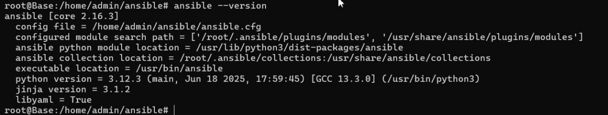
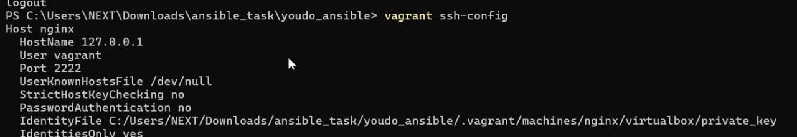
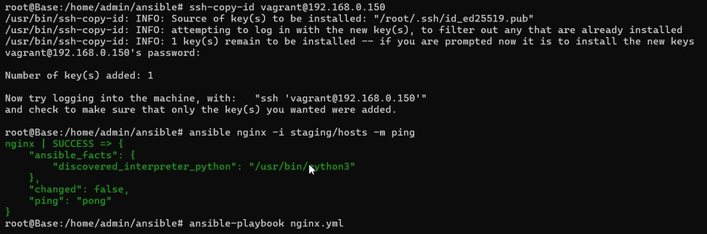
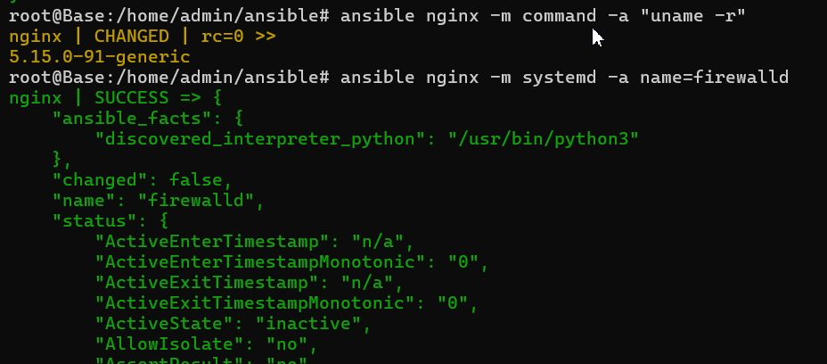
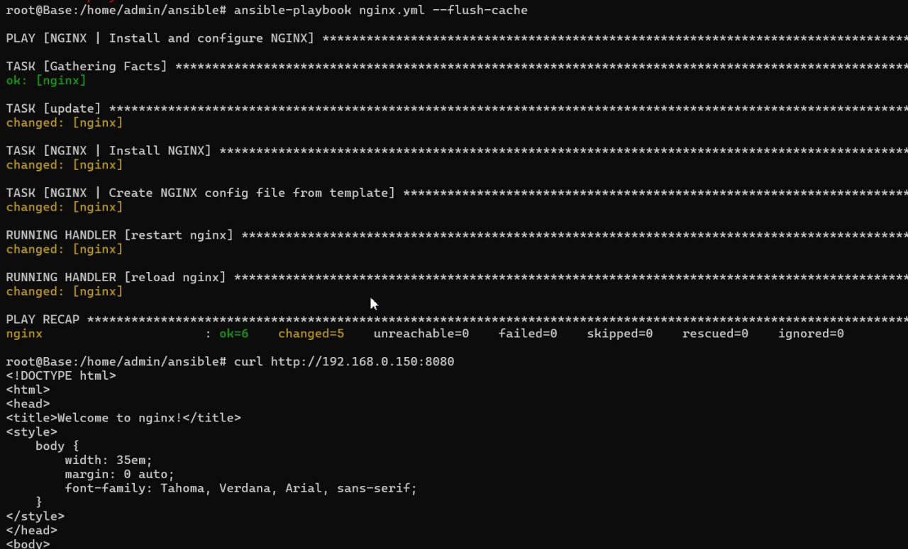

# Выполнение домашней работы по теме Автоматизация администрирования. Ansible-1
### Цель домашнего задания.

#### Написать первые шаги с Ansible;

Подготлен стенд на Vagrant как минимум с  сервером. На этом сервере, используя Ansible  \  
развернут nginx со следующими условиями:
 модуль yum/apt
конфигурационный файлы  взяты из шаблона jinja2 с переменными
после установки nginx в режиме enabled в systemd
 использован notify для старта nginx после установки
сайт слушает на нестандартном порту - 8080, для этого использованы переменные в Ansible
* Сделано все это с использованием Ansible роли

Файлы приложены в папке ansible https://github.com/Artser/LinuxPartII/tree/main/%D0%90%D0%B2%D1%82%D0%BE%D0%BC%D0%B0%D1%82%D0%B8%D0%B7%D0%B0%D1%86%D0%B8%D1%8F%20%D0%B0%D0%B4%D0%BC%D0%B8%D0%BD%D0%B8%D1%81%D1%82%D1%80%D0%B8%D1%80%D0%BE%D0%B2%D0%B0%D0%BD%D0%B8%D1%8F.%20Ansible-1/ansible

**Установка Ansible** \
Версия Ansible =>2.4 требует для своей работы Python 2.6 или выше


Подготовка окружения
Vagrantfile
Создадим каталог Ansible и положим в него  Vagrantfile \
● Поднимите управляемый хост командой vagrant up и убедитесь, \
что все прошло успешно и есть доступ по ssh\
● Для подключения к хосту nginx нам необходимо будет передать множество\
параметров - это особенность Vagrant. Узнать эти параметры можно с помощью \
команды vagrant ssh-config. Вот основные необходимые нам:


Host nginx 		имя хоста\
HostName 127.0.0.1 	IP адрес\
User vagrant 		имя пользователя под которым подключаемся\
Port 2222 			порт, который проброшен на 127.0.0.1\
IdentityFile .vagrant/machines/nginx/virtualbox/private_key\
путь до приватного ключа\
Ansible
Создадим свой первый inventory файл ./staging/hosts
Со следующим содержимым:

```
[web]
nginx ansible_host=192.168.0.150 
nginx ansible_port=22 
#nginx ansible_private_key_file=.vagrant/machines/nginx/virtualbox/private_key
 
      
````

И наконец убедимся, что Ansible может управлять нашим хостом. Сделать это \
можно с помощью команды:

Чтобы каждый раз явно не указывать наш инвентори файл и вписывать в него много\
информации. Это можно обойти используя ansible.cfg файл - прописав конфигурацию \
в нем.
● Для этого в текущем каталоге создадим файл ansible.cfg со следующим содержанием:\
```
[defaults]
inventory           = staging/hosts
remote_user         = vagrant
host_key_checking   = False
retry_files_enabled = False
      
````
Теперь, когда мы убедились, что у нас все подготовлено - установлен  
Ansible, поднят хост для теста и Ansible имеет к нему доступ, мы можем  
конфигурировать наш хост.  
Для начала воспользуемся Ad-Hoc командами и выполним некоторые  
удаленные команды на нашем хосте.  
Посмотрим какое ядро установлено на хосте:
Проверим статус сервиса firewalld



● Далее добавим шаблон для конфига NGINX и модуль, который будет
копировать этот шаблон на хост:
●Сразу же пропишем в Playbook необходимую нам переменную. Нам нужно
чтобы NGINX слушал на порту 8080:

Результирующий файл nginx.yml. Теперь можно его запустить

```
---
- name: NGINX | Install and configure NGINX
  hosts: nginx
  become: true
  vars:
    nginx_listen_port: 8080

  tasks:
    - name: update
      apt:
        update_cache=yes
      tags:
        - update apt

    - name: NGINX | Install NGINX
      apt:
        name: nginx
        state: latest
      notify:
        restart nginx
      tags:
        - nginx-package

    - name: NGINX | Create NGINX config file from template
      template:
        src: templates/nginx.conf.j2
        dest: /etc/nginx/nginx.conf
      notify:
        reload nginx
      tags:
        - nginx-configuration

  handlers:
    - name: restart nginx
      systemd:
        name: nginx
        state: restarted
        enabled: yes
    - name: reload nginx
      systemd:
        name: nginx
        state: reloaded
      
````
