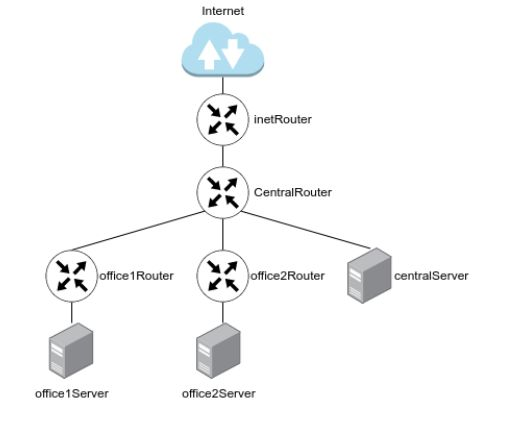
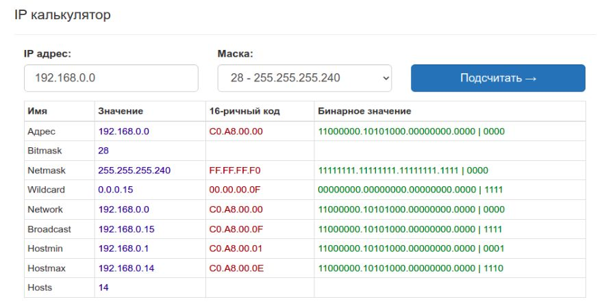
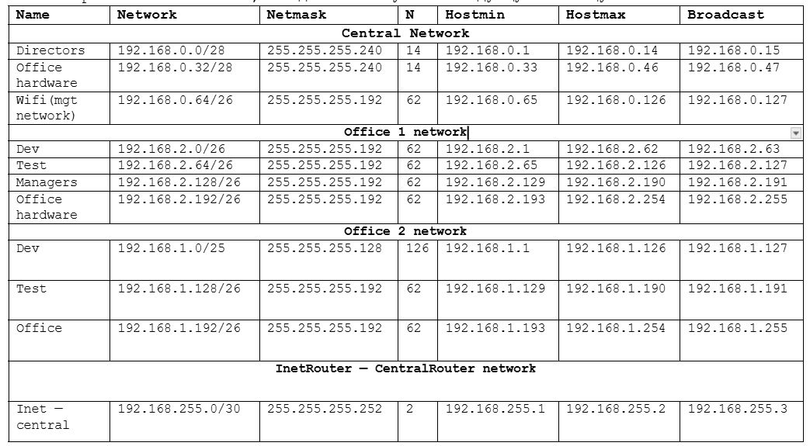
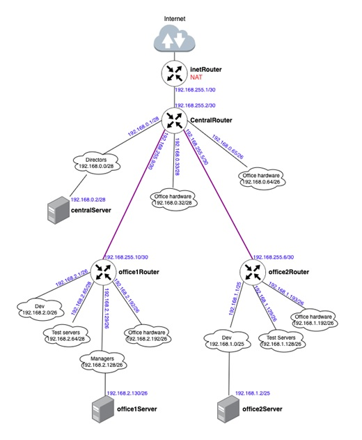
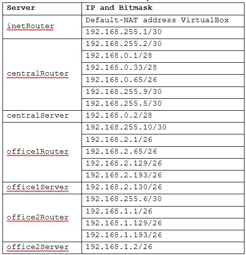
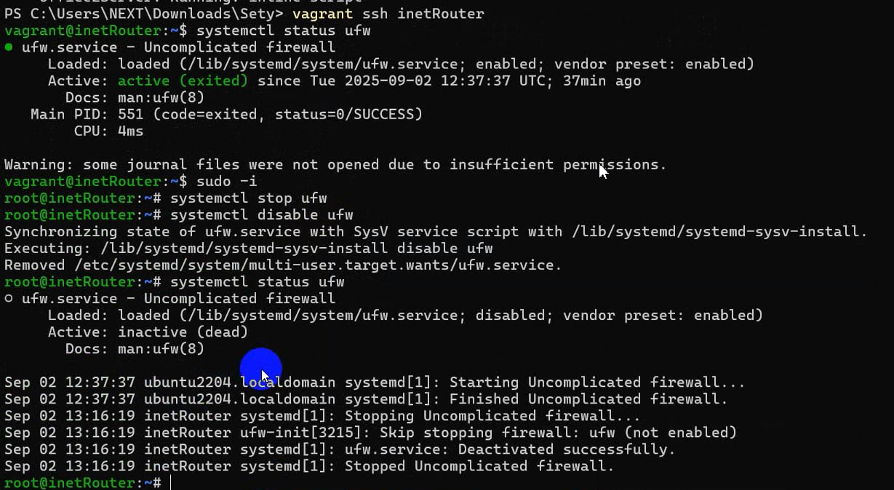
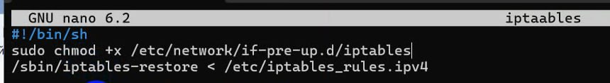
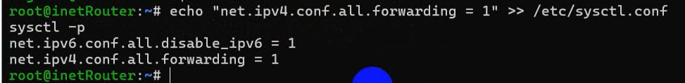
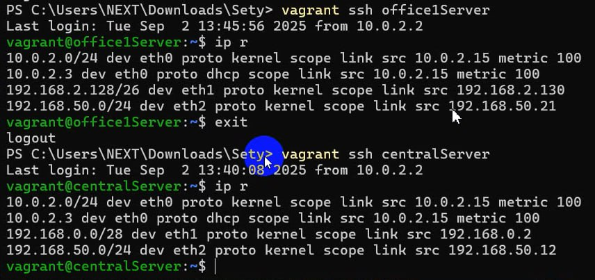

# Выполнение домашней работы по теме Архитектура сетей
### Цель домашнего задания.

#### ННаучится менять базовые сетевые настройки в Linux-based системах.

### Описание домашнего задания.


1. Скачать и развернуть Vagrant-стенд https://github.com/erlong15/otus-linux/tree/network
2. Построить следующую сетевую архитектуру:
   Сеть office1
- 192.168.2.0/26      - dev
- 192.168.2.64/26     - test servers
- 192.168.2.128/26    - managers
- 192.168.2.192/26    - office hardware

Сеть office2
- 192.168.1.0/25      - dev
- 192.168.1.128/26    - test servers
- 192.168.1.192/26    - office hardware

Сеть central
- 192.168.0.0/28     - directors
- 192.168.0.32/28    - office hardware
- 192.168.0.64/26    - wifi



Итого должны получиться следующие сервера:
inetRouter
centralRouter
office1Router
office2Router
centralServer
office1Server
office2Server

Задание состоит из 2-х частей: теоретической и практической.
В теоретической части требуется:
Найти свободные подсети
Посчитать количество узлов в каждой подсети, включая свободные
Указать Broadcast-адрес для каждой подсети
Проверить, нет ли ошибок при разбиении

В практической части требуется:
Соединить офисы в сеть согласно логической схеме и настроить роутинг
Интернет-трафик со всех серверов должен ходить через inetRouter
Все сервера должны видеть друг друга (должен проходить ping)
У всех новых серверов отключить дефолт на NAT (eth0), который vagrant поднимает для связи
Добавить дополнительные сетевые интерфейсы, если потребуется

Рекомендуется использовать Vagrant + Ansible для настройки данной схемы.


Введение
Сеть — очень важная составляющая в работе серверов. По сети сервера взаимодействуют между собой.
В данном домашнем задании мы рассмотрим технологии маршрутизации и NAT.
Маршрутизация — выбор оптимального пути передачи пакетов. Для маршрутизации используется таблица маршрутизации.
Основная задача маршрутизации — доставить пакет по указанному IP-адресу.
Если одно устройство имеет сразу несколько подсетей, например в сервере есть 2 порта с адресами:
192.168.1.10/24
10.10.12.72/24
то, такие сети называются непосредственно подключенными (Directly connected networks). Маршрутизация между Directly Connected  
сетями происходит автоматически. Дополнительная настройка не требуется.
Если необходимая сеть удалена, маршрутизатор будет искать через какой порт она будет доступна, если такой порт не найден, то трафик  
уйдет на шлюз по умолчанию.
Маршрутизация бывает статическая и динамическая.
При использовании статической маршрутизации администратор сам создает правила для маршрутов. Плюсом данного метода является   
безопасность, так как статические маршруты не обновляются по сети, а минусом — сложности при работе с сетями больших объёмов…
Динамическая маршрутизация подразумевает автоматическое построение маршрутов с помощью различных протоколов (RIP,OSPF,BGP, и.т.д.).  
Маршрутизаторы сами обмениваются друг с другом информацией о сетях и автоматически прописывают маршруты.
NAT — это процесс, используемый для преобразования сетевых адресов.
Основные цели NAT:
Экономия публичных IPv4-адресов
Повышение степени конфиденциальности и безопасности сети.
NAT обычно работает на границе, где локальная сеть соединяется с сетью Интернет. Когда устройству сети потребуется подключение к   
устройству вне его сети (например в Интернете), пакет пересылается маршрутизатору с NAT, а маршрутизатор преобразовывает его   
внутренний адрес в публичный.

Функциональные и нефункциональные требования
ПК на Unix c 12ГБ ОЗУ или виртуальная машина с включенной Nested Virtualization.
Предварительно установленное и настроенное следующее ПО:
Hashicorp Vagrant (https://www.vagrantup.com/downloads)
Oracle VirtualBox (https://www.virtualbox.org/wiki/Linux_Downloads).
Ansible (версия 2.7 и выше) - https://docs.ansible.com/ansible/latest/installation_guide/intro_installation.html
Любой редактор кода, например Visual Studio Code, Atom и т.д.


### Выполнение домашнего задания.

### 1. Теоретическая часть

В теоретической части нам необходимо продумать топологию сети, а также:
Найти свободные подсети
Посчитать количество узлов в каждой подсети, включая свободные
Указать Broadcast-адрес для каждой подсети
Проверить, нет ли ошибок при разбиении

Первым шагом мы рассмотрим все сети, указанные в задании. Посчитаем для них количество узлов, найдём Broadcast-адрес, проверим, нет ли ошибок при разбиении.

Расчеты можно выполнить вручную, или воспользоваться калькулятором сетей. Для примера, посчитаем одну подсеть вручную:

У нас есть сеть directors 192.168.0.0/28
192.168.0.0 — это сама сеть, 28 — это маска. Маска показывает нам, границы сети 192.168.0.0. Маска может быть записана в 2-х видах:
1) /28
2) 255.255.255.240


Пример перевода маски /28 в формат 255.255.255.240:

Маска Ipv4-адреса — это 4 октета, т.е. 4 блока по 8 цифр (1 или 0).
/28 — это 28 единиц с начала маски: 11111111.11111111.11111111.11110000  
Всегда при разбиении сетей, после знака / указывается количество единиц с начала маски.

11111111.11111111.11111111.11110000 — это двоичный код маски, если мы переведем данное значение в десятичную систему счисления, то получим 255.255.255.240

Далее посчитаем количество устройств в сети:
Количество устройств в сети рассчитывается по формуле = 232−маска−2
Таким образом, количество устройств для подсети /28 будет = 232−28−2=16−2=14

Цифра 2 вычитается, так как:
Первый адрес (192.168.0.0) — это наименование подсети, его нельзя задать устройству
Последний адрес (192.168.0.15) — это всегда broadcast-адрес. Broadcast-адрес нужен для рассылки всем устройствам сети.

Таким образом мы можем сформировать таблицу топологии нашей сети

|Сеть|Маска|Кол-во адресов|Первый адрес в сети|Последний адрес в сети|Broadcast — адрес|
|----|-----|--------------|-------------------|----------------------|-----------------|
|192.168.0.0/28|255.255.255.240|14|192.168.0.1|192.168.0.14|192.168.0.15|


По такому примеру нужно рассчитать остальные сети. Для проверки себя можно использовать
использовать калькулятор масок, например, этот - https://ip-calculator.ru/

Для того, чтобы получить всю информацию по сети, потребуется указать ip-адрес и маску, например:



После расчета всех сетей, мы должны получить следующую таблицу топологии


После создания таблицы топологии, мы видим, что ошибок в задании нет, также мы сразу видим следующие свободные сети:

+ 192.168.0.16/28
+ 192.168.0.48/28
+ 192.168.0.128/25
+ 192.168.255.64/26
+ 192.168.255.32/27
+ 192.168.255.16/28
+ 192.168.255.8/29  
+ 192.168.255.4/30

На этом теоретическая часть заканчивается. Можем приступать к выполнению практической части.

### 2. Практическая часть

Изучив таблицу топологии сети и Vagrant-стенд из задания, мы можем построить полную схему сети:


Давайте рассмотрим схему:
Знак облака означает сеть, которую необходимо будет настроить на сервере
Значки роутеров и серверов означают хосты, которые нам нужно будет создать.

На схеме, мы сразу можем увидеть, что нам потребуется создать дополнительно 2 сети (на схеме обозначены полужирными фиолетовыми линиями):
Для соединения office1Router c centralRouter
Для соединения office2Router c centralRouter

На основании этой схемы мы получаем готовый список серверов.


Создаем vagrantfile следующего содержания

````
MACHINES = {
  :inetRouter => {
        :box_name => "generic/ubuntu2204",
        :vm_name => "inetRouter",
        #:public => {:ip => "10.10.10.1", :adapter => 1},
        :net => [   
                    #ip, adpter, netmask, virtualbox__intnet
                    ["192.168.255.1", 2, "255.255.255.252",  "router-net"], 
                    ["192.168.50.10", 8, "255.255.255.0"],
                ]
  },

  :centralRouter => {
        :box_name => "generic/ubuntu2204",
        :vm_name => "centralRouter",
        :net => [
                   ["192.168.255.2",  2, "255.255.255.252",  "router-net"],
                   ["192.168.0.1",    3, "255.255.255.240",  "dir-net"],
                   ["192.168.0.33",   4, "255.255.255.240",  "hw-net"],
                   ["192.168.0.65",   5, "255.255.255.192",  "mgt-net"],
                   ["192.168.255.9",  6, "255.255.255.252",  "office1-central"],
                   ["192.168.255.5",  7, "255.255.255.252",  "office2-central"],
                   ["192.168.50.11",  8, "255.255.255.0"],
                ]
  },

  :centralServer => {
        :box_name => "generic/ubuntu2204",
        :vm_name => "centralServer",
        :net => [
                   ["192.168.0.2",    2, "255.255.255.240",  "dir-net"],
                   ["192.168.50.12",  8, "255.255.255.0"],
                ]
  },

  :office1Router => {
        :box_name => "generic/ubuntu2204",
        :vm_name => "office1Router",
        :net => [
                   ["192.168.255.10",  2,  "255.255.255.252",  "office1-central"],
                   ["192.168.2.1",     3,  "255.255.255.192",  "dev1-net"],
                   ["192.168.2.65",    4,  "255.255.255.192",  "test1-net"],
                   ["192.168.2.129",   5,  "255.255.255.192",  "managers-net"],
                   ["192.168.2.193",   6,  "255.255.255.192",  "office1-net"],
                   ["192.168.50.20",   8,  "255.255.255.0"],
                ]
  },

  :office1Server => {
        :box_name => "generic/ubuntu2204",
        :vm_name => "office1Server",
        :net => [
                   ["192.168.2.130",  2,  "255.255.255.192",  "managers-net"],
                   ["192.168.50.21",  8,  "255.255.255.0"],
                ]
  },

  :office2Router => {
       :box_name => "generic/ubuntu2204",
       :vm_name => "office2Router",
       :net => [
                   ["192.168.255.6",  2,  "255.255.255.252",  "office2-central"],
                   ["192.168.1.1",    3,  "255.255.255.128",  "dev2-net"],
                   ["192.168.1.129",  4,  "255.255.255.192",  "test2-net"],
                   ["192.168.1.193",  5,  "255.255.255.192",  "office2-net"],
                   ["192.168.50.30",  8,  "255.255.255.0"],
               ]
  },

  :office2Server => {
       :box_name => "generic/ubuntu2204",
       :vm_name => "office2Server",
       :net => [
                  ["192.168.1.2",    2,  "255.255.255.128",  "dev2-net"],
                  ["192.168.50.31",  8,  "255.255.255.0"],
               ]
  }
}

Vagrant.configure("2") do |config|
  MACHINES.each do |boxname, boxconfig|
    config.vm.define boxname do |box|
      box.vm.box = boxconfig[:box_name]
      box.vm.host_name = boxconfig[:vm_name]
      
      box.vm.provider "virtualbox" do |v|
        v.memory = 768
        v.cpus = 1
       end

      boxconfig[:net].each do |ipconf|
        box.vm.network("private_network", ip: ipconf[0], adapter: ipconf[1], netmask: ipconf[2], virtualbox__intnet: ipconf[3])
      end

      if boxconfig.key?(:public)
        box.vm.network "public_network", boxconfig[:public]
      end

      box.vm.provision "shell", inline: <<-SHELL
        mkdir -p ~root/.ssh
        cp ~vagrant/.ssh/auth* ~root/.ssh
      SHELL
    end
  end
end

````

Настройка NAT
Для того, чтобы на всех серверах работал интернет, на сервере inetRouter должен быть настроен NAT. В нашем Vagrantfile он настраивался с помощью команды:
iptables -t nat -A POSTROUTING ! -d 192.168.0.0/16 -o eth0 -j MASQUERADE
При настройке NAT таким образом, правило удаляется после перезагрузки сервера. Для того, чтобы правила применялись после перезагрузки, в Ubuntu 22.04 нужно выполнить следующие действия:
1)Подключиться по SSH к хосту: vagrant ssh inetRouter
2)Проверить, что отключен другой файервол: systemctl status ufw




3) Создаём файл /etc/iptables_rules.ipv4:
   nano /etc/iptables_rules.ipv4

````
# Generated by iptables-save v1.8.7 on Sat Oct 14 16:14:36 2023
*filter
:INPUT ACCEPT [90:8713]
:FORWARD ACCEPT [0:0]
:OUTPUT ACCEPT [54:7429]
-A INPUT -p icmp -j ACCEPT
-A INPUT -i lo -j ACCEPT
-A INPUT -p tcp -m state --state NEW -m tcp --dport 22 -j ACCEPT
COMMIT
# Completed on Sat Oct 14 16:14:36 2023
# Generated by iptables-save v1.8.7 on Sat Oct 14 16:14:36 2023
*nat
:PREROUTING ACCEPT [1:44]
:INPUT ACCEPT [1:44]
:OUTPUT ACCEPT [0:0]
:POSTROUTING ACCEPT [0:0]
-A POSTROUTING ! -d 192.168.0.0/16 -o eth0 -j MASQUERADE
COMMIT
# Completed on Sat Oct 14 16:14:36 2023

````
4) Создаём файл, в который добавим скрипт автоматического восстановления правил при перезапуске системы:
   nano /etc/network/if-pre-up.d/iptables
````
#!/bin/sh
/sbin/iptables-restore < /etc/iptables_rules.ipv4
````

5) Добавляем права на выполнение файла /etc/network/if-pre-up.d/iptables
   sudo chmod +x /etc/network/if-pre-up.d/iptables

6) Перезагружаем сервер: reboot
7) После перезагрузки сервера проверяем правила iptables: iptables-save

Маршрутизация транзитных пакетов (IP forward)

Важным этапом настройки сетевой лаборатории, является маршрутизация транзитных пакетов. Если объяснить простыми словами — это возможность сервера Linux пропускать трафик через себя к другому серверу. По умолчанию эта функция отключена в Linux. Включить её можно командой:
echo "net.ipv4.conf.all.forwarding = 1" >> /etc/sysctl.conf
sysctl -p

Посмотреть статус форвардинга можно командой: sysctl net.ipv4.ip_forward
Если параметр равен 1, то маршрутизация транзитных пакетов включена, если 0 — отключена.

В нашей схеме необходимо включить данную маршрутизацию на всех роутерах.



Отключение маршрута по умолчанию на интерфейсе eth0

При разворачивании нашего стенда Vagrant создает в каждом сервере свой интерфейс, через который у сервера появляется доступ в интернет. Отключить данный порт нельзя, так как через него Vagrant подключается к серверам. Обычно маршрут по умолчанию прописан как раз на этот интерфейс, данный маршрут нужно отключить:


Для отключения маршрута по умолчанию в файле /etc/netplan/00-installer-config.yaml добавляем отключение маршрутов, полученных через DHCP:
````
# This is the network config written by 'subiquity'
network:
ethernets:
eth0:
dhcp4: true
dhcp4-overrides:
use-routes: false
dhcp6: false
version: 2
````
После внесения данных изменений перезапускаем сетевую службу:
netplan try

Отключение дефолтного маршрута требуется настроить на всех хостах кроме inetRouter

Посмотреть список всех маршрутов: ip route
root@office1Server:~# ip r



