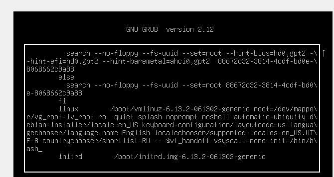
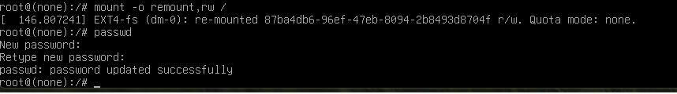
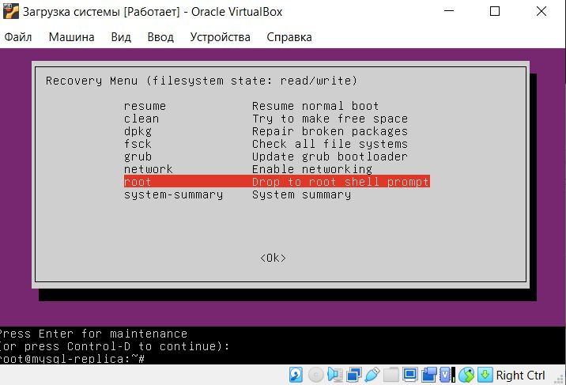
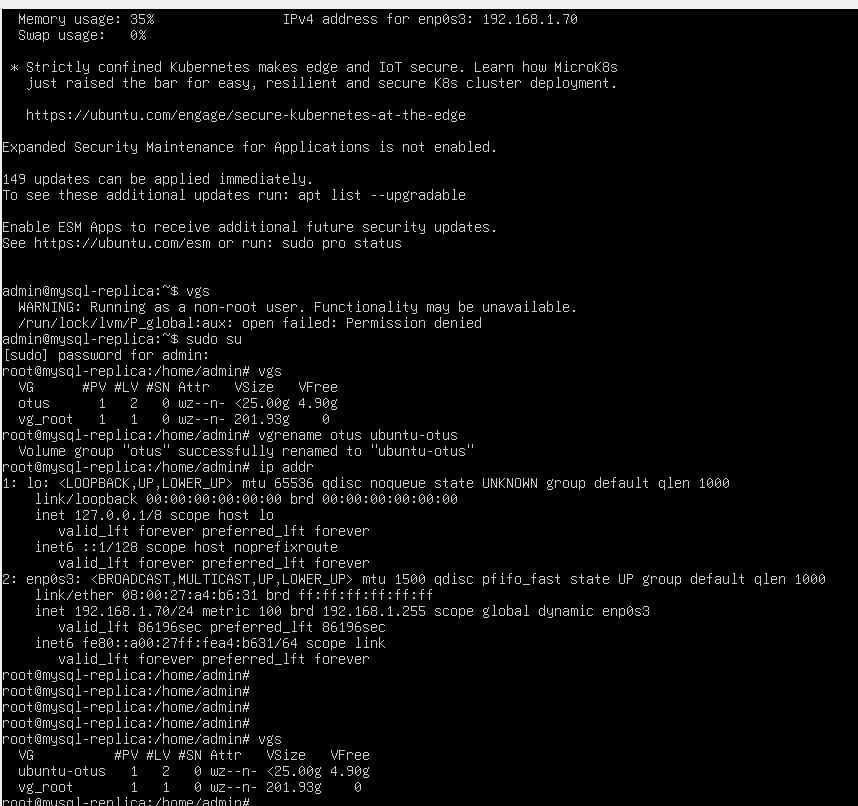

### Задачи

Включить отображение меню Grub.
<br>
Попасть в систему без пароля несколькими способами.
<br>
Установить систему с LVM, после чего переименовать VG.
<br>


### Решение

#### 1. Для включения отображения изменим настройки файла /etc/default/grub внесем только изменение в строчки указанные ниже

 ```bash
GRUB_TIMEOUT_STYLE=menu  #Позволит нам показывать меню
GRUB_TIMEOUT=5           #Задержка времени для показа меню
 ```
После внесения измеенний введем

 ```bash
 root@mysql-replica:~$ sudo update-grub
Sourcing file `/etc/default/grub'
Generating grub configuration file ...
Found linux image: /boot/vmlinuz-6.8.0-60-generic
Found initrd image: /boot/initrd.img-6.8.0-60-generic
Found linux image: /boot/vmlinuz-6.8.0-59-generic
Found initrd image: /boot/initrd.img-6.8.0-59-generic
Warning: os-prober will not be executed to detect other bootable partitions.
Systems on them will not be added to the GRUB boot configuration.
Check GRUB_DISABLE_OS_PROBER documentation entry.
Adding boot menu entry for UEFI Firmware Settings ...
done
 ```

Это позволит нам применить настройки для grub


#### 2.  Попасть в систему нескольким способами ( изменение пароля пользователя если вы его забыли)

При запуске меню с выбором запуска системы жмем 'e'
Далее находим строку запуска системы и добовляем в нее init=/bin/bash , что приведет к запуску системы в однопользовательском режиме




После запуска системы в одно пользовательском режиме вводим
```bash
mount -o remount,ro / # Для перемантирования рут в режиме rw
passwd      # для смены пароля root  и после ввода команды 2 раза вводим новый пароль root  
```


**Способ 2. Recovery mode**  
В меню загрузчика на первом уровне выбрать второй пункт (Advanced options…), далее загрузить пункт меню с указанием recovery mode в названии.
Получим меню режима восстановления.  

В этом меню сначала включаем поддержку сети (network) для того, чтобы файловая система перемонтировалась в режим read/write (либо это можно сделать вручную).
Далее выбираем пункт root и попадаем в консоль с пользователем root. Если вы ранее устанавливали пароль для пользователя root (по умолчанию его нет), то необходимо его ввести.  
В этой консоли можно производить любые манипуляции с системой.  


#### 3. Переименование VG

Входим в режим восстановлвения в Grub, для этого при запуске выбираем пункт Меню Recovery


Выбераем пункт root

Далее изменяем наименование  Volume Group при помощи команды Vgrename  текущее_имя новое_имя
После переимновния необходимо провести изменения в файле /boot/grub/grub.cfg заменить текущее_имя на новое _имя




