# Выполнение домашней работы по теме Практика c SELinux
### Цель домашнего задания.

#### Диагностировать проблемы и модифицировать политики SELinux для корректной работы приложений, если это требуется;

1. Запустить Nginx на нестандартном порту 3-мя разными способами:  
   ● переключатели setsebool;  
   ● добавление нестандартного порта в имеющийся тип;  
   ● формирование и установка модуля SELinux.  
   К сдаче:  
   ● README с описанием каждого решения (скриншоты и демонстрация приветствуются).  

2. Обеспечить работоспособность приложения при включенном selinux.  
   ● развернуть приложенный стенд https://github.com/Nickmob/vagrant_selinux_dns_problems;  
   ● выяснить причину неработоспособности механизма обновления зоны (см. README);  
   ● предложить решение (или решения) для данной проблемы;  
   ● выбрать одно из решений для реализации, предварительно обосновав выбор;  
   ● реализовать выбранное решение и продемонстрировать его работоспособность.  

Файлы приложены в папке selinux 

Все дальнейшие действия были проверены при использовании Vagrant 2.4.3, VirtualBox v7.1.4 и   
образа Almalinux/9 (версия 9.4.20240805) из Vagrant cloud.

## 0. Создаём виртуальную машину

Код стенда можно получить из репозитория: https://github.com/Nickmob/vagrant_selinux
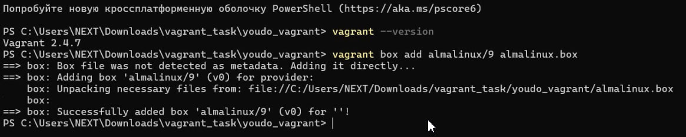

Результатом выполнения команды vagrant up станет созданная виртуальная машина с установленным nginx, который работает   
на порту TCP 4881. Порт TCP 4881 уже проброшен до хоста. SELinux включен.  
Во время развёртывания стенда попытка запустить nginx завершится с ошибкой:  
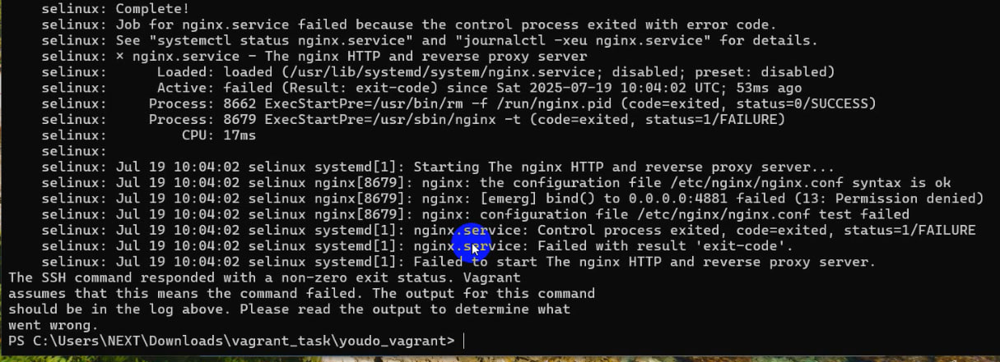

Данная ошибка появляется из-за того, что SELinux блокирует работу nginx на нестандартном порту.    
Заходим на сервер: vagrant ssh   
Дальнейшие действия выполняются от пользователя root. Переходим в root пользователя: sudo -i    
## 1.Запуск nginx на нестандартном порту 3-мя разными способами  

Для начала проверим, что в ОС отключен файервол: systemctl status firewalld  
Также можно проверить, что конфигурация nginx настроена без ошибок: nginx -t  
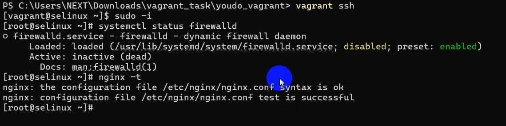

Далее проверим режим работы SELinux: getenforce  
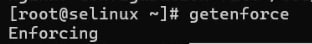

Должен отображаться режим Enforcing. Данный режим означает, что SELinux будет блокировать запрещенную активность.  
### Разрешим в SELinux работу nginx на порту TCP 4881 c помощью переключателей setsebool  
Находим в логах (cat /var/log/audit/audit.log | less;) информацию о блокировании порта  
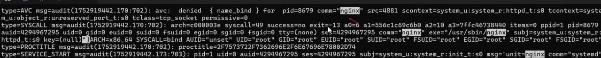

Копируем время, в которое был записан этот лог, и, с помощью утилиты audit2why смотрим  	 
grep 1752919442.170:702 /var/log/audit/audit.log | audit2why

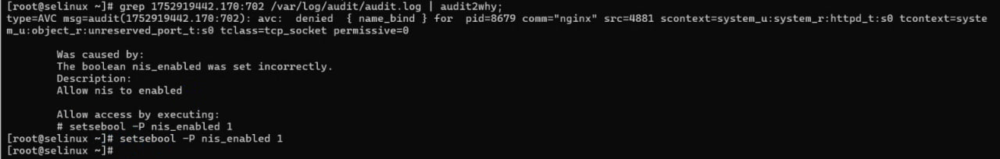

Утилита audit2why покажет почему трафик блокируется. Исходя из вывода утилиты, мы видим, что нам нужно поменять  
параметр nis_enabled.
Включим параметр nis_enabled и перезапустим nginx: setsebool -P nis_enabled on

[root@selinux ~]# setsebool -P nis_enabled on  
[root@selinux ~]# systemctl restart nginx  
[root@selinux ~]# systemctl status nginx  

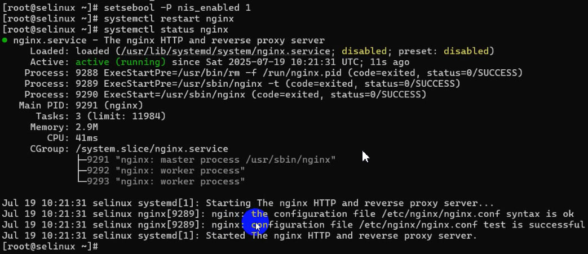

Также можно проверить работу nginx из браузера. Заходим в любой браузер на хосте и переходим по адресу http://127.0.0.1:4881
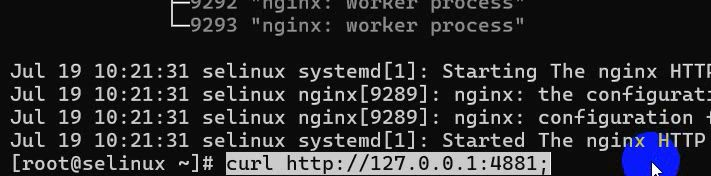

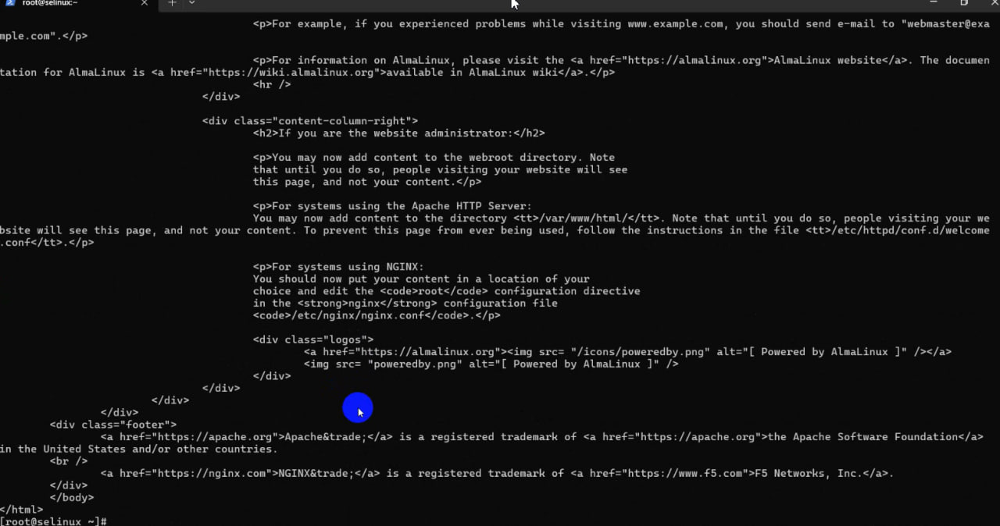

### Теперь разрешим в SELinux работу nginx на порту TCP 4881 c помощью добавления нестандартного порта в имеющийся тип:
Поиск имеющегося типа, для http трафика: semanage port -l | grep http
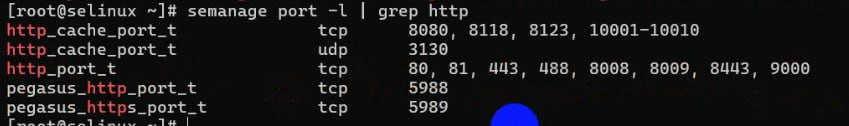

Добавим порт в тип http_port_t: semanage port -a -t http_port_t -p tcp 4881
Теперь перезапускаем службу nginx и проверим её работу: systemctl restart nginx
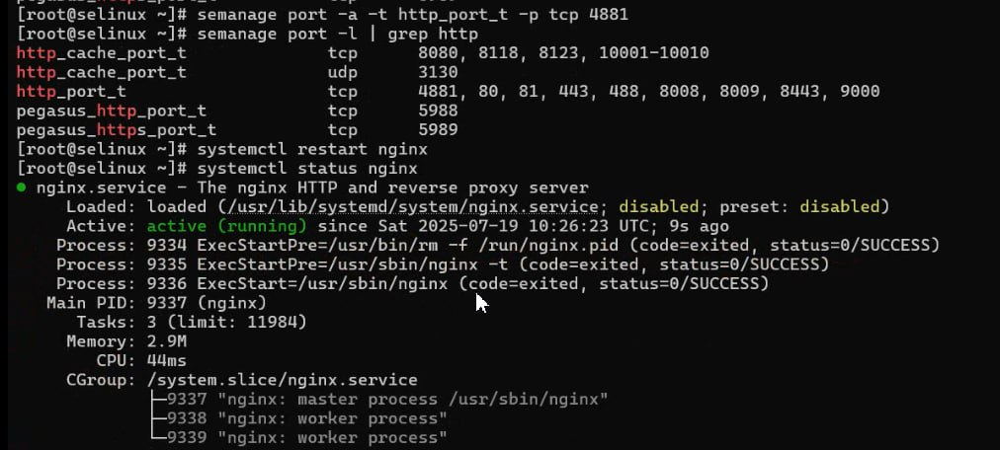

Удалим нестандартный порт из имеющегося типа можно с помощью команды: semanage port -d -t http_port_t -p tcp 4881
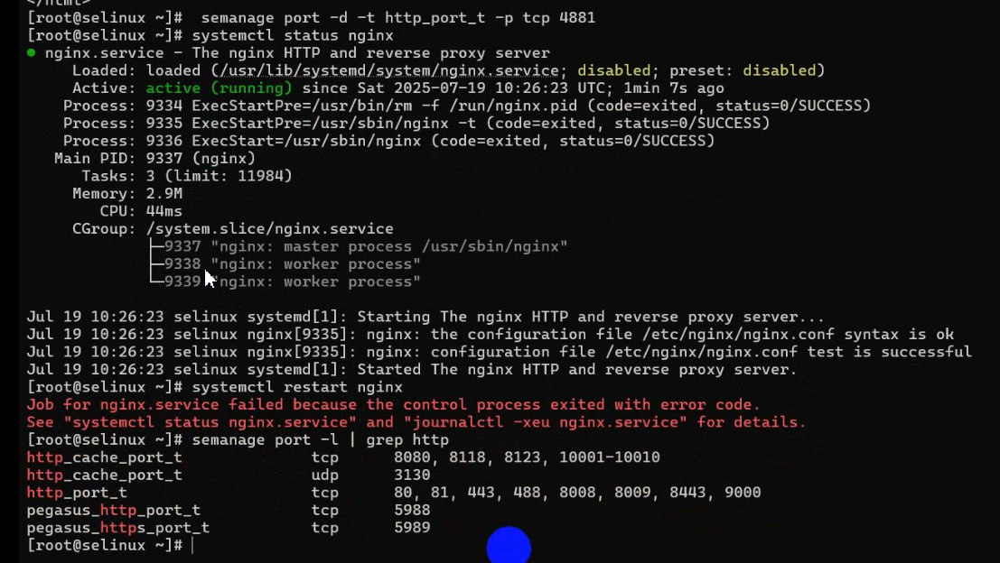

### Разрешим в SELinux работу nginx на порту TCP 4881 c помощью формирования и установки модуля SELinux:
Попробуем снова запустить Nginx: systemctl start nginx
Nginx не запустится, так как SELinux продолжает его блокировать. Посмотрим логи SELinux, которые относятся к Nginx:
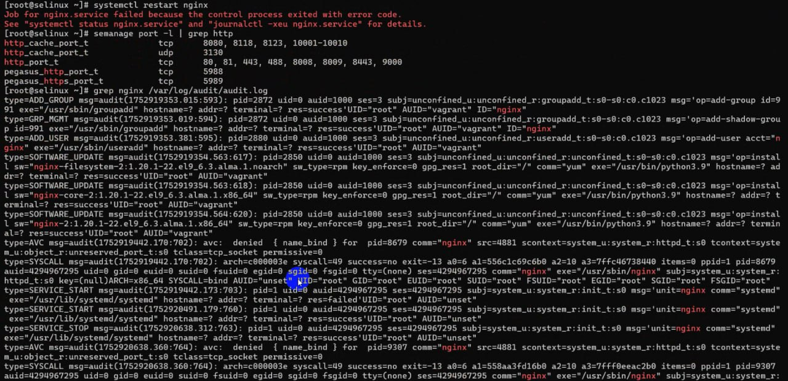

Воспользуемся утилитой audit2allow для того, чтобы на основе логов SELinux сделать модуль, разрешающий работу nginx на нестандартном порту:
grep nginx /var/log/audit/audit.log | audit2allow -M nginx
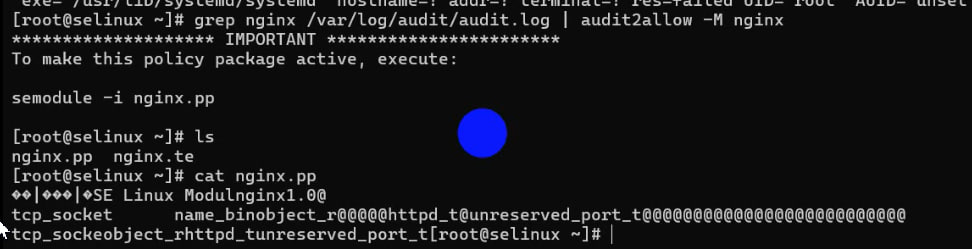
Audit2allow сформировал модуль, и сообщил нам команду, с помощью которой можно применить данный модуль: semodule -i nginx.pp
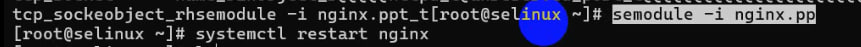

После добавления модуля nginx запустился без ошибок. При использовании модуля изменения сохранятся после перезагрузки.
Просмотр всех установленных модулей: semodule -l
Для удаления модуля воспользуемся командой: semodule -r nginx

## 2 Обеспечение работоспособности приложения при включенном SELinux

Для того, чтобы развернуть стенд потребуется хост, с установленным git и ansible.
Инструкция по установке Ansible - https://docs.ansible.com/ansible/latest/installation_guide/intro_installation.html
Выполним клонирование репозитория:
git clone https://github.com/Nickmob/vagrant_selinux_dns_problems.git
Cloning into 'vagrant_selinux_dns_problems'...
remote: Enumerating objects: 24, done.
remote: Counting objects: 100% (24/24), done.
remote: Compressing objects: 100% (18/18), done.
remote: Total 24 (delta 4), reused 21 (delta 4), pack-reused 0 (from 0)
Receiving objects: 100% (24/24), 6.40 KiB | 6.40 MiB/s, done.
Resolving deltas: 100% (4/4), done.

Перейдём в каталог со стендом: cd vagrant_selinux_dns_problems
Развернём 2 ВМ с помощью vagrant: vagrant up
После того, как стенд развернется, проверим ВМ с помощью команды: vagrant status
Подключимся к клиенту: vagrant ssh client

Попробуем внести изменения в зону: nsupdate -k /etc/named.zonetransfer.key

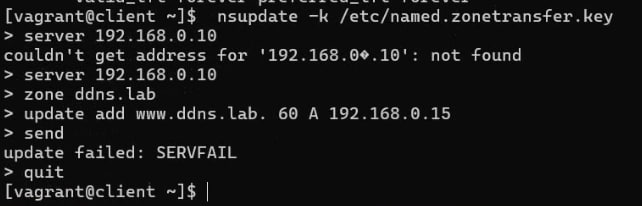

Изменения внести не получилось. Давайте посмотрим логи SELinux, чтобы понять в чём может быть проблема.
Для этого воспользуемся утилитой audit2why:

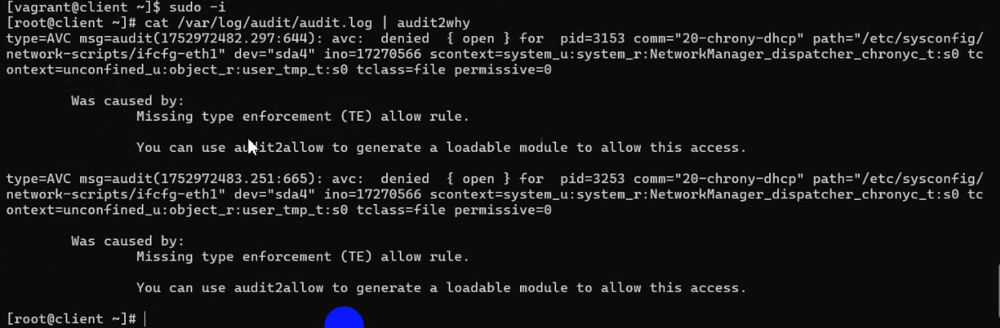

Тут мы видим, что на клиенте отсутствуют ошибки.
Не закрывая сессию на клиенте, подключимся к серверу ns01 и проверим логи SELinux:cat /var/log/audit/audit.log | audit2why

В логах мы видим, что ошибка в контексте безопасности. Целевой контекст named_conf_t.
Для сравнения посмотрим существующую зону (localhost) и её контекст:
[root@ns01 ~]# ls -alZ /var/named/named.localhost

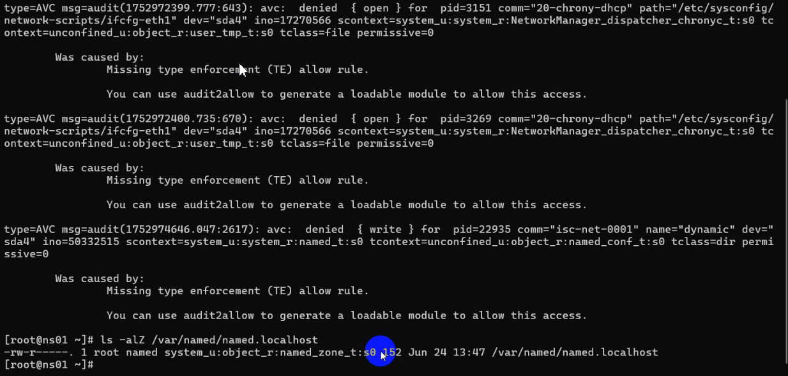

У наших конфигов в /etc/named вместо типа named_zone_t используется тип named_conf_t.
Проверим данную проблему в каталоге /etc/named:
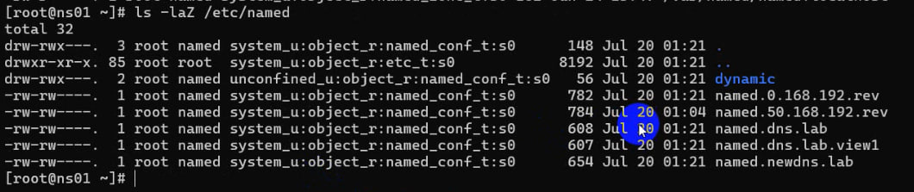

Тут мы также видим, что контекст безопасности неправильный. Проблема заключается в том, что конфигурационные файлы лежат в другом каталоге. Посмотреть в каком каталоги должны лежать, файлы, чтобы на них распространялись правильные политики SELinux можно с помощью команды: sudo semanage fcontext -l | grep named
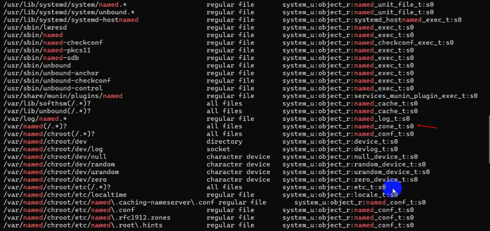

Изменим тип контекста безопасности для каталога /etc/named: sudo chcon -R -t named_zone_t /etc/named
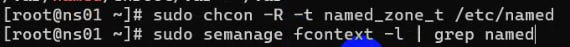

Попробуем снова внести изменения с клиента:
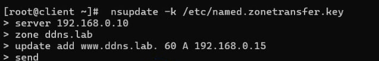
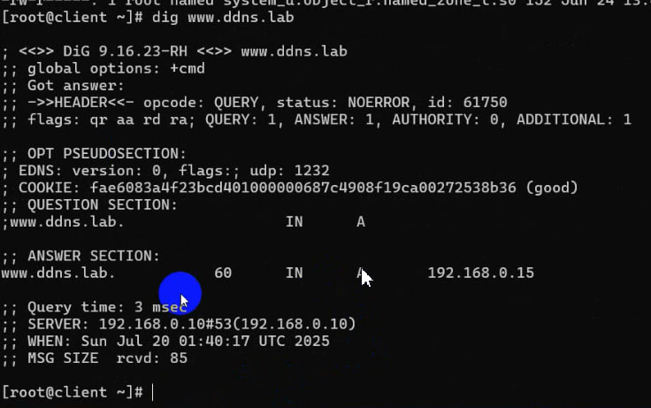
Видим, что изменения применились. Попробуем перезагрузить хосты и ещё раз сделать запрос с помощью dig:
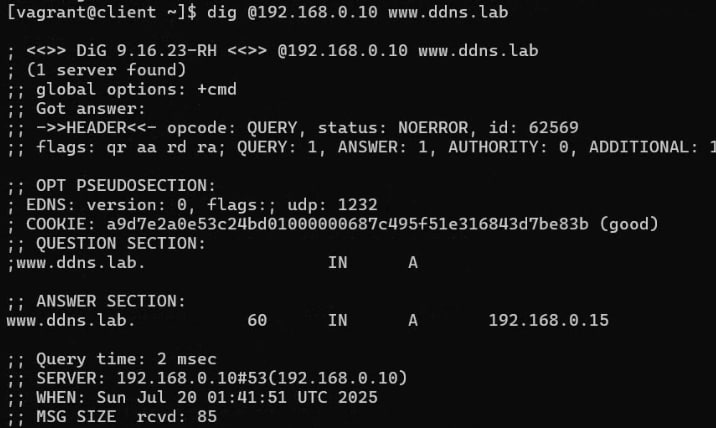

Всё правильно. После перезагрузки настройки сохранились.
Важно, что мы не добавили новые правила в политику для назначения этого контекста в каталоге. Значит, что при перемаркировке файлов контекст вернётся на тот, который прописан в файле политики.
Для того, чтобы вернуть правила обратно, можно ввести команду: restorecon -v -R /etc/named

