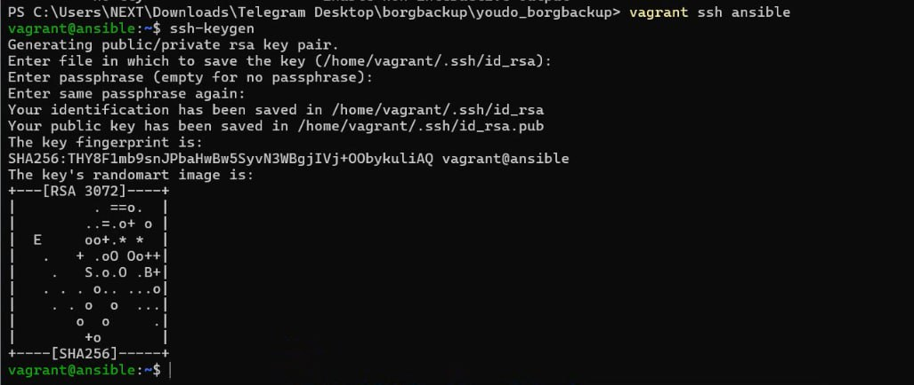
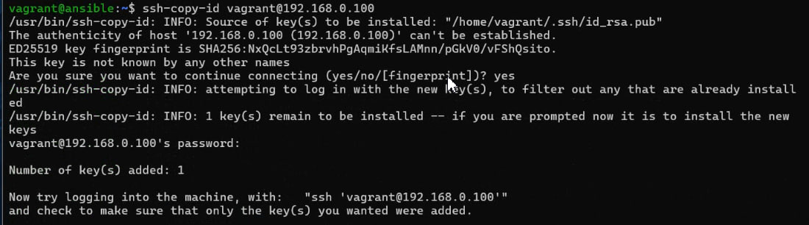
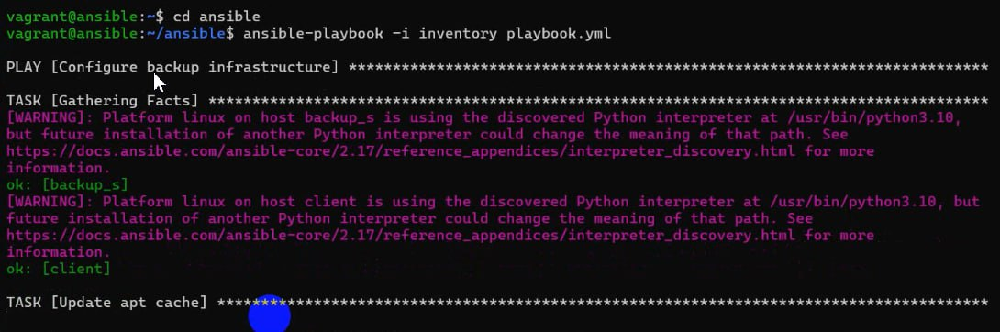
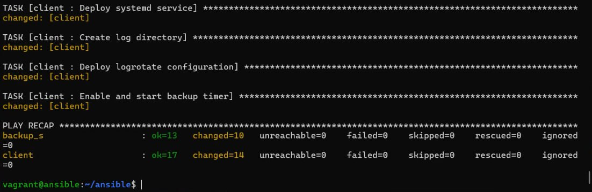
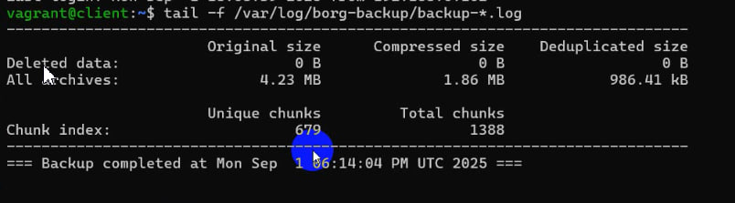
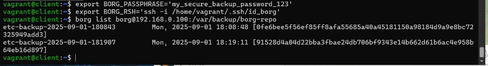
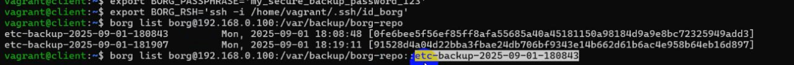

# Выполнение домашней работы по теме Резервное копирование
### Цель домашнего задания.

#### Научиться настраивать резервное копирование с помощью утилиты Borg

### Описание домашнего задания.

1. Настроить стенд Vagrant с двумя виртуальными машинами: backup_server и client. (Студент самостоятельно настраивает Vagrant)
2. Настроить удаленный бэкап каталога /etc c сервера client при помощи borgbackup. Резервные копии должны соответствовать следующим критериям:
+ директория для резервных копий /var/backup. Это должна быть отдельная точка монтирования. В данном случае для демонстрации размер не принципиален, достаточно будет и 2GB; (Студент самостоятельно настраивает)
+ репозиторий для резервных копий должен быть зашифрован ключом или паролем - на усмотрение студента;
+ имя бэкапа должно содержать информацию о времени снятия бекапа;
+ глубина бекапа должна быть год, хранить можно по последней копии на конец месяца, кроме последних трех. Последние три месяца должны содержать копии на каждый день. Т.е. должна быть правильно настроена политика удаления старых бэкапов;
+ резервная копия снимается каждые 5 минут. Такой частый запуск в целях демонстрации;
+ написан скрипт для снятия резервных копий. Скрипт запускается из соответствующей Cron джобы, либо systemd timer-а - на усмотрение студента;
+ настроено логирование процесса бекапа. Для упрощения можно весь вывод перенаправлять в logger с соответствующим тегом. Если настроите не в syslog, то обязательна ротация логов.

Ссылка на файл vagrant https://github.com/Artser/LinuxPartII/blob/main/%D0%A0%D0%B5%D0%B7%D0%B5%D1%80%D0%B2%D0%BD%D0%BE%D0%B5%20%D0%BA%D0%BE%D0%BF%D0%B8%D1%80%D0%BE%D0%B2%D0%B0%D0%BD%D0%B8%D0%B5/Vagrantfile
Ссылка на папку ansible https://github.com/Artser/LinuxPartII/tree/main/%D0%A0%D0%B5%D0%B7%D0%B5%D1%80%D0%B2%D0%BD%D0%BE%D0%B5%20%D0%BA%D0%BE%D0%BF%D0%B8%D1%80%D0%BE%D0%B2%D0%B0%D0%BD%D0%B8%D0%B5/ansible
 
Сначала подключимся к машине ansible и создадим ключ, который затем скопируем чтобы можно было подключаться без пароля к хосту

запускаем ansible

Видим, что создалось 2 машины

Выведем на экран последние строки файла

смотрим список файлов которые сделаны

команда которой можно проверять содержание файлов

