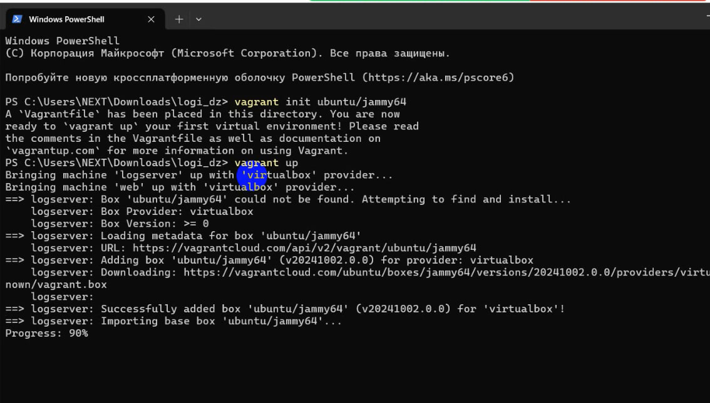
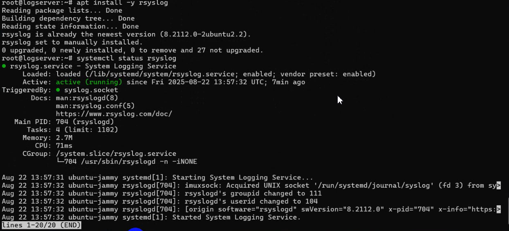
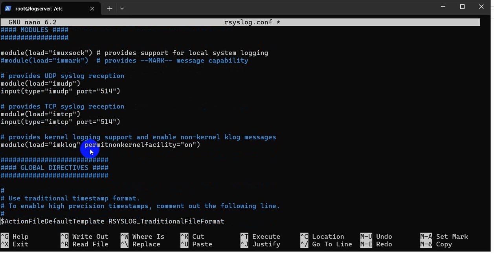
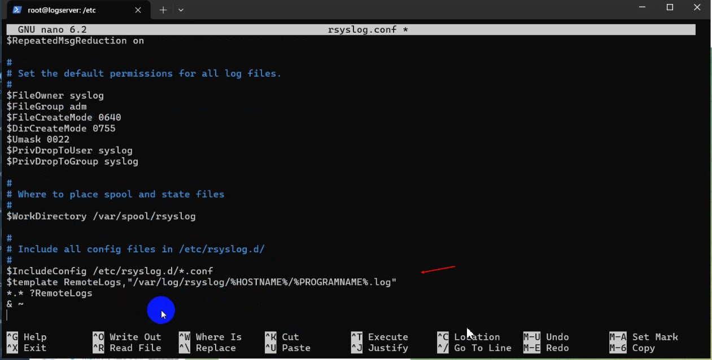
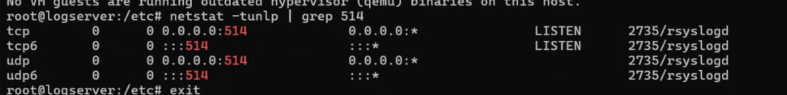
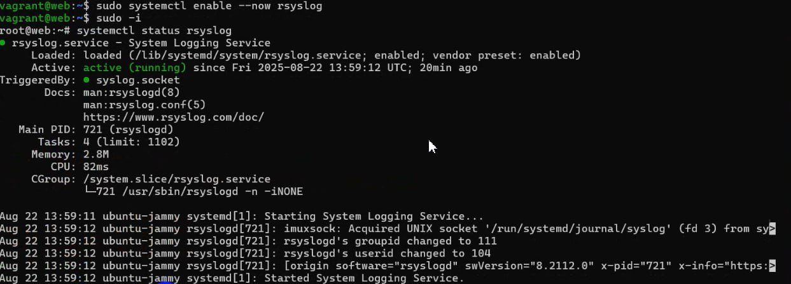
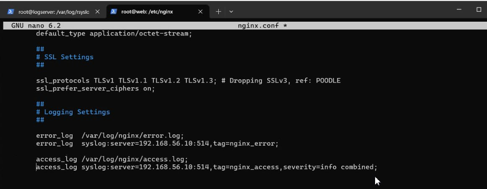
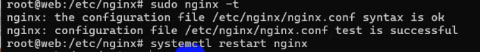
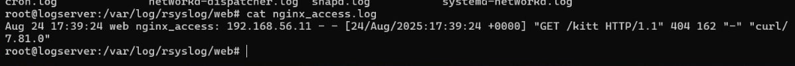

# Выполнение домашней работы по теме Основы сбора и хранения логов
### Цель домашнего задания.

#### Научится проектировать централизованный сбор логов. Рассмотреть особенности разных платформ для сбора логов.

### Описание домашнего задания.


1. В Vagrant разворачиваем 2 виртуальные машины web и log
2. на web настраиваем nginx
3. на log настраиваем центральный лог сервер на любой системе на выбор
   journald;
   rsyslog;
   elk.
4. настраиваем аудит, следящий за изменением конфигов nginx

Все критичные логи с web должны собираться и локально и удаленно.
Все логи с nginx должны уходить на удаленный сервер (локально только критичные).
Логи аудита должны также уходить на удаленную систему.

### Выполнение домашнего задания.

1. Создаём виртуальные машины
   Создаём каталог, в котором юбудут храниться настройки виртуальной машины. В каталоге создаём файл с именем Vagrantfile, добавляем в него следующее содержимое:


````
Vagrant.configure("2") do |config|
  # Общая конфигурация для базового box
  config.vm.box = "ubuntu/jammy64"

  # ВМ для rsyslog-сервера (централизованный лог-сервер)
  config.vm.define "logserver" do |srv|
    srv.vm.hostname = "logserver"
    srv.vm.network "private_network", ip: "192.168.56.10"
  end

  # ВМ для web-сервера (nginx)
  config.vm.define "web" do |web|
    web.vm.hostname = "web"
    web.vm.network "private_network", ip: "192.168.56.11"
  end

end

````

Результатом выполнения команды vagrant up станут 2 созданные виртуальные машины
Заходим на web-сервер: vagrant ssh web
Дальнейшие действия выполняются от пользователя root. Переходим в root пользователя: sudo -i
Для правильной работы c логами, нужно, чтобы на всех хостах было настроено одинаковое время.

2. Установка nginx на виртуальной машине web


Установим nginx: apt update && apt install -y nginx

Проверим, что nginx работает корректно:


3. Настройка центрального сервера сбора логов


Откроем еще одно окно терминала и подключаемся по ssh к ВМ log: vagrant ssh log
Перейдем в пользователя root: sudo -i
rsyslog должен быть установлен по умолчанию в нашей ОС, проверим это:




Все настройки Rsyslog хранятся в файле /etc/rsyslog.conf
Для того, чтобы наш сервер мог принимать логи, нам необходимо внести следующие изменения в файл:
Открываем порт 514 (TCP и UDP):
Находим закомментированные строки:

И приводим их к виду:




В конец файла /etc/rsyslog.conf добавляем правила приёма сообщений от хостов:
Данные параметры будут отправлять в папку /var/log/rsyslog логи, которые будут приходить от других серверов.      
Например, Access-логи nginx от сервера web, будут идти в файл /var/log/rsyslog/web/nginx_access.log      
Далее сохраняем файл и перезапускаем службу rsyslog: systemctl restart rsyslog    
Если ошибок не допущено, то у нас будут видны открытые порты TCP,UDP 514:   


Далее настроим отправку логов с web-сервера
Заходим на web сервер: vagrant ssh web
Переходим в root пользователя: sudo -i
Проверим версию nginx: nginx -v


Для Access-логов указываем удаленный сервер и уровень логов, которые нужно отправлять.  
Для error_log добавляем удаленный сервер. Если требуется чтобы логи хранились локально и отправлялись   
на удаленный сервер, требуется указать 2 строки. 	
Tag нужен для того, чтобы логи записывались в разные файлы.  



По умолчанию, error-логи отправляют логи, которые имеют severity: error, crit, alert и emerg. Если требуется хранить или пересылать логи с другим severity, то это также можно указать в настройках nginx.
Далее проверяем, что конфигурация nginx указана правильно: nginx -t  

Далее перезапускаем nginx: systemctl restart nginx  

Попробуем несколько раз зайти по адресу http://192.168.56.10
Далее заходим на log-сервер и смотрим информацию об nginx:
cat /var/log/rsyslog/web/nginx_access.log
cat /var/log/rsyslog/web/nginx_error.log


Поскольку наше приложение работает без ошибок, файл nginx_error.log не будет создан. Чтобы сгенерировать ошибку, можно переместить файл веб-страницы, который открывает nginx -
mv /var/www/html/index.nginx-debian.html /var/www/
После этого мы получим 403 ошибку.
Видим, что логи отправляются корректно.




